FTICR results
================

------------------------------------------------------------------------

## I. Metabolomics (21T)

click to expand

### Van Krevelen Domains

    #> $gg_vk_domains

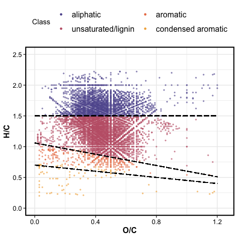<!-- -->

    #> 
    #> $gg_vk_domains_nosc

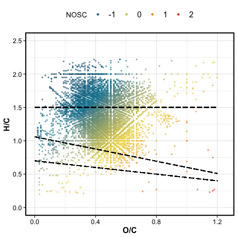<!-- -->

------------------------------------------------------------------------

### Van Krevelen Diagrams

All molecules identified

    #> $gg_vankrev_all

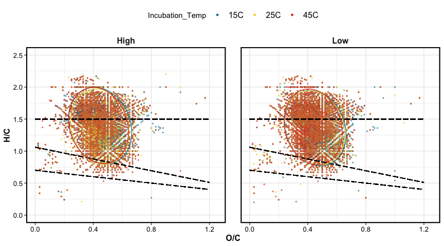<!-- -->

Unique molecules per temperature/CUE

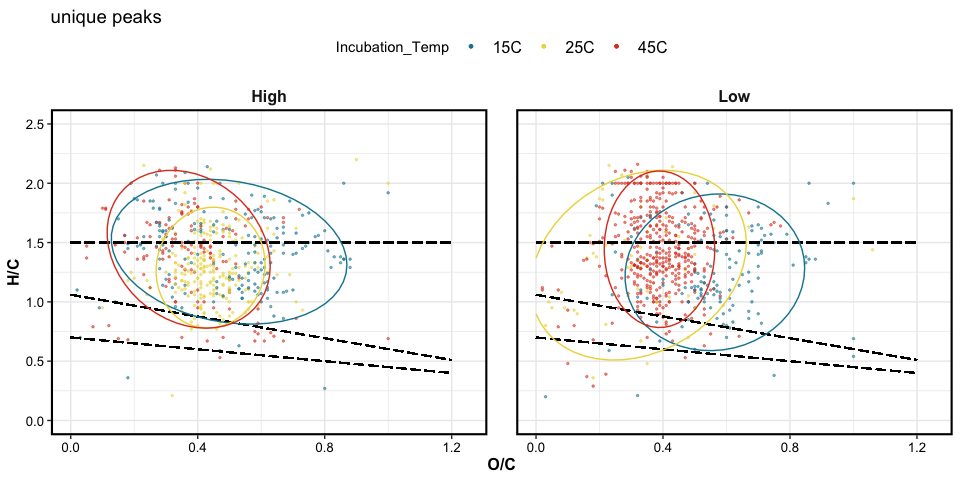<!-- -->

------------------------------------------------------------------------

### Relative Abundance

    #> $relabund_bar_trt

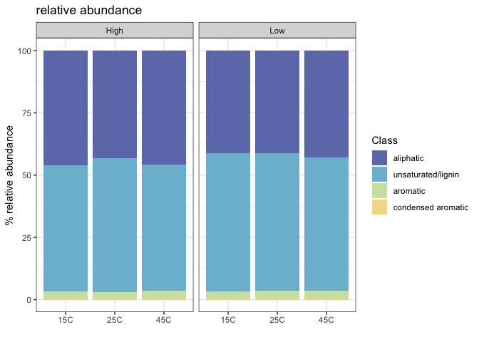<!-- -->

------------------------------------------------------------------------

### PERMANOVA

| term                            |  df | SumsOfSqs |   MeanSqs |   F.Model |        R2 | p.value |
|:--------------------------------|----:|----------:|----------:|----------:|----------:|--------:|
| Incubation\_Temp                |   2 | 0.0022091 | 0.0011046 |  8.722768 | 0.1830032 |   0.002 |
| A\_priori\_CUE                  |   1 | 0.0064604 | 0.0064604 | 51.018274 | 0.5351802 |   0.001 |
| Incubation\_Temp:A\_priori\_CUE |   2 | 0.0011226 | 0.0005613 |  4.432670 | 0.0929972 |   0.028 |
| Residuals                       |  18 | 0.0022793 | 0.0001266 |        NA | 0.1888195 |      NA |
| Total                           |  23 | 0.0120715 |        NA |        NA | 1.0000000 |      NA |

### PCA

    #> $gg_pca_overall

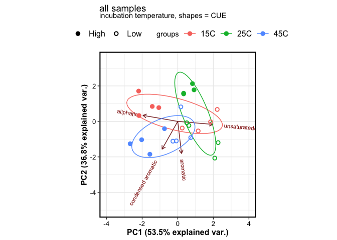<!-- -->

    #> 
    #> $gg_pca_highCUE

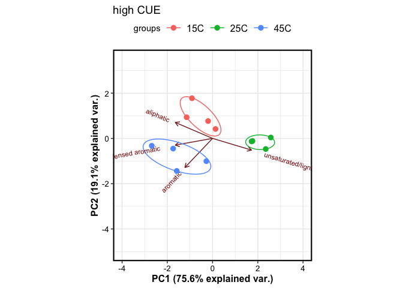<!-- -->

    #> 
    #> $gg_pca_lowCUE

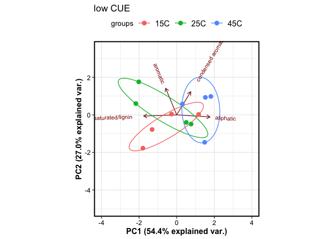<!-- -->

------------------------------------------------------------------------

## II. Lipidomics (12T)

click to expand

### Van Krevelen Domains

    #> $gg_vk_domains

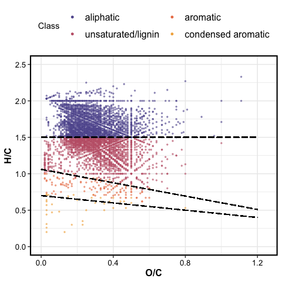<!-- -->

    #> 
    #> $gg_vk_domains_nosc

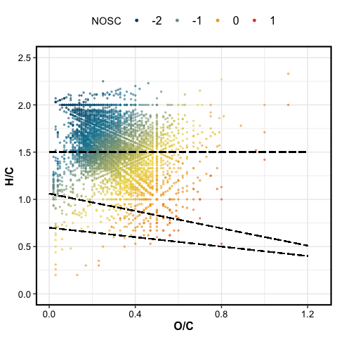<!-- -->

------------------------------------------------------------------------

### Van Krevelen Diagrams

All molecules identified

    #> $gg_vankrev_all

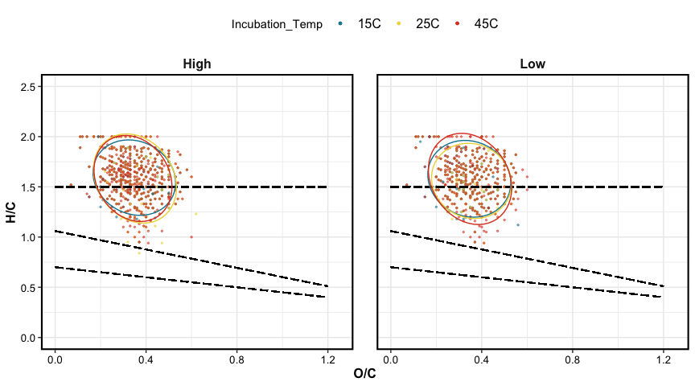<!-- -->

Unique molecules per temperature/CUE

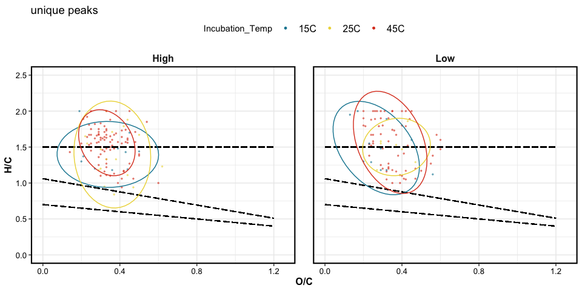<!-- -->

------------------------------------------------------------------------

### Relative Abundance

    #> $relabund_bar_trt

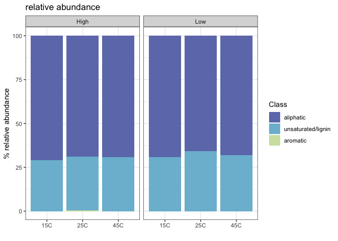<!-- -->

------------------------------------------------------------------------

### PERMANOVA

| term                            |  df | SumsOfSqs |   MeanSqs |   F.Model |        R2 | p.value |
|:--------------------------------|----:|----------:|----------:|----------:|----------:|--------:|
| Incubation\_Temp                |   2 | 0.0027330 | 0.0013665 | 10.315481 | 0.3326927 |   0.001 |
| A\_priori\_CUE                  |   1 | 0.0026433 | 0.0026433 | 19.954355 | 0.3217818 |   0.001 |
| Incubation\_Temp:A\_priori\_CUE |   2 | 0.0004539 | 0.0002270 |  1.713372 | 0.0552593 |   0.211 |
| Residuals                       |  18 | 0.0023845 | 0.0001325 |        NA | 0.2902661 |      NA |
| Total                           |  23 | 0.0082147 |        NA |        NA | 1.0000000 |      NA |

------------------------------------------------------------------------

## III. Metabolomics (12T)

click to expand

### Van Krevelen Domains

    #> $gg_vk_domains

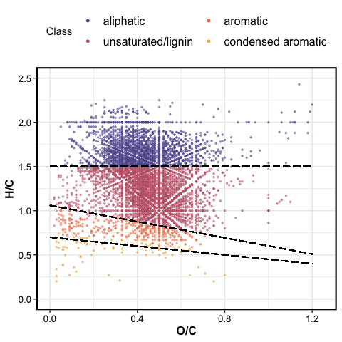<!-- -->

    #> 
    #> $gg_vk_domains_nosc

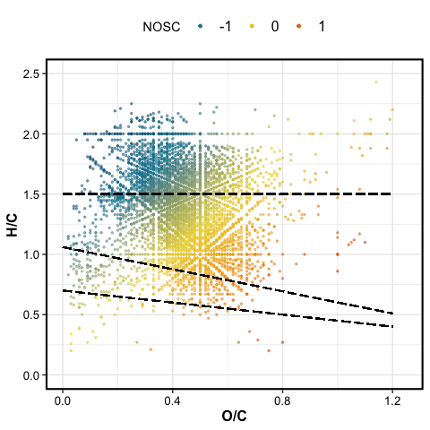<!-- -->

------------------------------------------------------------------------

### Van Krevelen Diagrams

All molecules identified

    #> $gg_vankrev_all

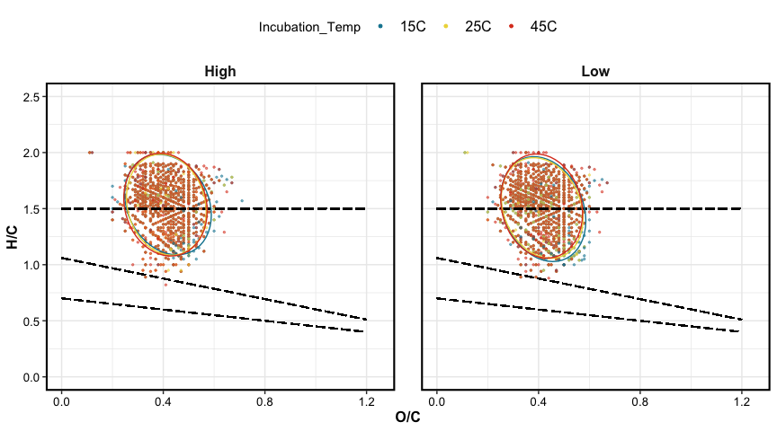<!-- -->

Unique molecules per temperature/CUE

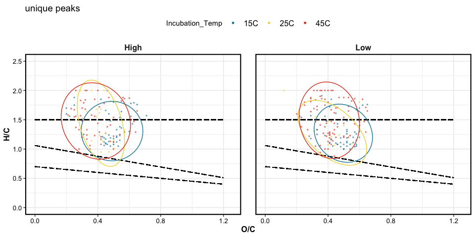<!-- -->

------------------------------------------------------------------------

### Relative Abundance

    #> $relabund_bar_trt

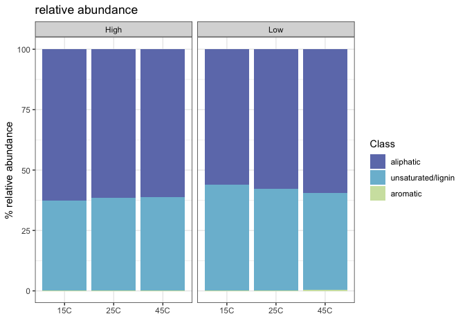<!-- -->

------------------------------------------------------------------------

### PERMANOVA

| term                            |  df | SumsOfSqs |   MeanSqs |   F.Model |        R2 | p.value |
|:--------------------------------|----:|----------:|----------:|----------:|----------:|--------:|
| Incubation\_Temp                |   2 | 0.0004443 | 0.0002221 |  1.761836 | 0.0308462 |   0.205 |
| A\_priori\_CUE                  |   1 | 0.0092918 | 0.0092918 | 73.693872 | 0.6451153 |   0.001 |
| Incubation\_Temp:A\_priori\_CUE |   2 | 0.0023977 | 0.0011988 |  9.508054 | 0.1664668 |   0.005 |
| Residuals                       |  18 | 0.0022696 | 0.0001261 |        NA | 0.1575718 |      NA |
| Total                           |  23 | 0.0144034 |        NA |        NA | 1.0000000 |      NA |

    #> $gg_pca_overall

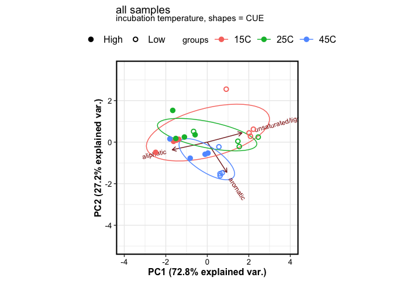<!-- -->

    #> 
    #> $gg_pca_highCUE

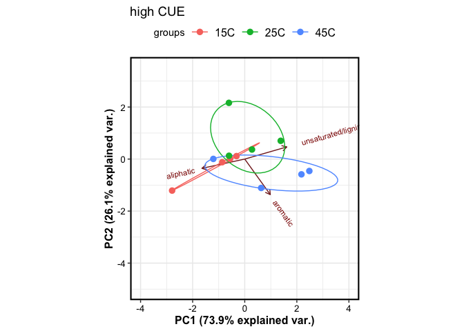<!-- -->

    #> 
    #> $gg_pca_lowCUE

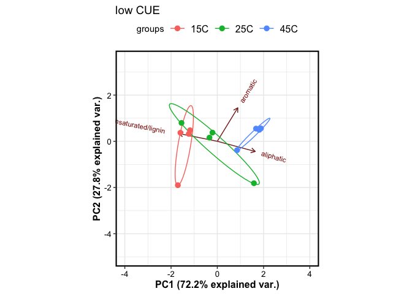<!-- -->

------------------------------------------------------------------------

------------------------------------------------------------------------

## Session Info

click to expand

Date run: 2022-05-23

    #> R version 4.1.1 (2021-08-10)
    #> Platform: x86_64-apple-darwin17.0 (64-bit)
    #> Running under: macOS Catalina 10.15.7
    #> 
    #> Matrix products: default
    #> BLAS:   /System/Library/Frameworks/Accelerate.framework/Versions/A/Frameworks/vecLib.framework/Versions/A/libBLAS.dylib
    #> LAPACK: /Library/Frameworks/R.framework/Versions/4.1/Resources/lib/libRlapack.dylib
    #> 
    #> locale:
    #> [1] en_US.UTF-8/en_US.UTF-8/en_US.UTF-8/C/en_US.UTF-8/en_US.UTF-8
    #> 
    #> attached base packages:
    #> [1] stats     graphics  grDevices utils     datasets  methods  
    #> [7] base     
    #> 
    #> other attached packages:
    #>  [1] patchwork_1.1.1    vegan_2.5-7        lattice_0.20-44   
    #>  [4] permute_0.9-5      ggbiplot_0.55      soilpalettes_0.1.0
    #>  [7] PNWColors_0.1.0    drake_7.13.2       data.table_1.14.2 
    #> [10] readxl_1.4.0       forcats_0.5.1      stringr_1.4.0     
    #> [13] dplyr_1.0.9        purrr_0.3.4        readr_2.1.2       
    #> [16] tidyr_1.2.0        tibble_3.1.5       ggplot2_3.3.6     
    #> [19] tidyverse_1.3.1   
    #> 
    #> loaded via a namespace (and not attached):
    #>  [1] httr_1.4.2        jsonlite_1.7.2    splines_4.1.1    
    #>  [4] modelr_0.1.8      assertthat_0.2.1  highr_0.9        
    #>  [7] base64url_1.4     cellranger_1.1.0  yaml_2.2.1       
    #> [10] progress_1.2.2    pillar_1.6.2      backports_1.2.1  
    #> [13] glue_1.6.2        digest_0.6.27     rvest_1.0.1      
    #> [16] colorspace_2.0-2  htmltools_0.5.2   Matrix_1.3-4     
    #> [19] plyr_1.8.6        pkgconfig_2.0.3   broom_0.8.0      
    #> [22] haven_2.4.3       scales_1.1.1      tzdb_0.1.2       
    #> [25] mgcv_1.8-36       txtq_0.2.4        generics_0.1.0   
    #> [28] farver_2.1.0      ellipsis_0.3.2    withr_2.5.0      
    #> [31] cli_3.3.0         magrittr_2.0.3    crayon_1.4.1     
    #> [34] evaluate_0.15     storr_1.2.5       fs_1.5.2         
    #> [37] fansi_0.5.0       MASS_7.3-54       nlme_3.1-153     
    #> [40] xml2_1.3.2        tools_4.1.1       prettyunits_1.1.1
    #> [43] hms_1.1.0         lifecycle_1.0.1   munsell_0.5.0    
    #> [46] reprex_2.0.1      cluster_2.1.2     compiler_4.1.1   
    #> [49] tinytex_0.33      rlang_1.0.2       grid_4.1.1       
    #> [52] rstudioapi_0.13   igraph_1.2.6      labeling_0.4.2   
    #> [55] rmarkdown_2.14    gtable_0.3.0      DBI_1.1.1        
    #> [58] R6_2.5.1          lubridate_1.8.0   knitr_1.39       
    #> [61] fastmap_1.1.0     utf8_1.2.2        filelock_1.0.2   
    #> [64] stringi_1.7.6     parallel_4.1.1    Rcpp_1.0.8       
    #> [67] vctrs_0.4.1       dbplyr_2.1.1      tidyselect_1.1.1 
    #> [70] xfun_0.31

